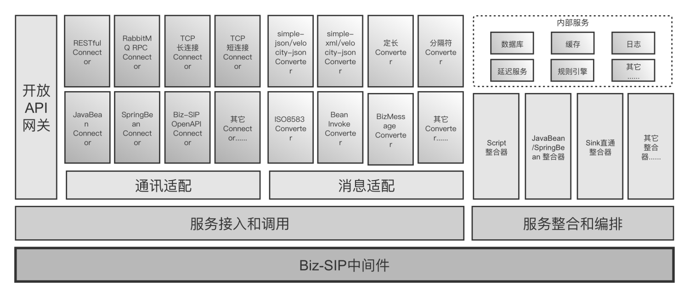
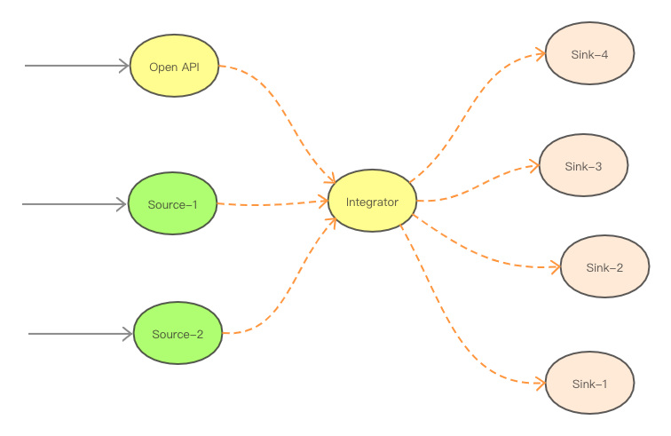
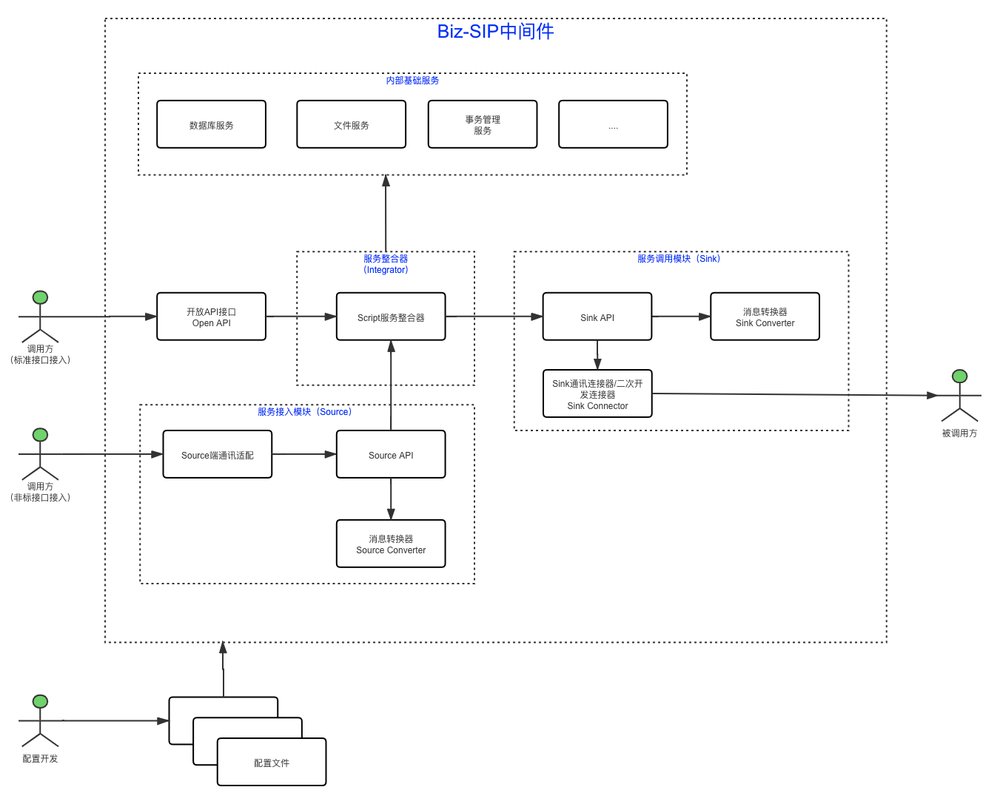





## 一、开发目标

Biz-SIP是一套基于领域驱动设计（DDD），用于快速构建金融级云原生架构的服务整合中间件，包含了在金融场景里锤炼出来的最佳实践。
主要功能有：

- 支持服务接入和服务调用：金融应用随着前后端分离架构、微服务架构、中台战略、产业互联互通的实施必将产生大量的各种协议业务系统的整合，系统之间的相互调用和依赖情况也随之越来越多和复杂，Biz-SIP中间件支持全面整合企业内外部应用和接口，打造业务中台；
- 支持标准接口接入和非标接口接入：标准接口采用标准的微服务接口接入，非标接口支持开箱即用的常用接口适配器，并支持个性化服务接入端的二次开发；
- 服务接入和服务调用，支持常用的开箱即用、可配置的消息格式适配能力和通讯协议适配能力；
  - 支持可配置的消息适配器：支持JSON、XML、定长、有分隔符、8583等报文等报文的解包和打包，并支持二次开发扩展；
  - 支持可配置的协议适配器：支持WebService、RESTful、消息中间件、TCP等通讯协议的对接，并支持二次开发扩展；
- 支持多种服务整合和编排方式：业务系统与业务系统之间、关联合作伙伴之间的系统调用都相应存在大量的服务相互调用和逻辑重组需求，目前支持脚本和Java SDK来进行服务的整合和编排；
- 丰富的内部服务集成：还可以在服务整合和编排中，加入数据库、内容存储、加密计算、AI计算、分布式事务等内部服务节点，从而进一步丰富服务整合的能力。
- 其它功能：支持服务消息中域级校验规则和服务级的阻断校验规则。

适合业务场景

- 中台战略：作为企业中台架构中的前置服务化平台的服务管理、发布平台
- 开放平台：将企业内部服务以OpenAPI方式对公众市场开放，共同打造应用场景
- 微服务架构：作业微服务架构中API相互调用、聚合、编排的统一平台
- 遗留系统：作为集成企业遗留系统的统一集成平台
- 协议转换：作为多个服务开发体系(SpringCloud、Dubbo、.Net)的统一服务转换和管理平台
- 逻辑重组：作为企业大量的API服务与服务之间的逻辑重组平台
- 系统解藕：解决系统服务之间相互藕合的问题
- 敏捷交付：可快速重组业务逻辑、敏捷交付业务应用，比传统代码模式交付速度提升80%

## 二、系统架构
系统分层架构，如下图所示：

整个Biz-SIP中间件主要包括：服务聚合器（App Integrator）、服务接入模块（Source）、服务调用模块（Sink）、Open API接口和内部基础服务五大块，其中：

- 服务整合器（App Integrator）：负责服务的整合和编排，对Source模块接入的聚合服务，进行服务编排，并通过Sink模块接入要编排的服务。
- 服务接入模块（Source）：负责聚合服务的接入，包括通讯协议适配和消息格式转换，并统一接入Integrator。
- 服务调用模块（Sink）：统一被Integrator所调用，负责接入要编排的服务，包括和外部服务对接时的通讯协议适配和消息格式转换。
- 开放API接口（Open API）：对外提供的标准的API接口，提供所有聚合服务的接入，后面是接入服务聚合器（Integrator）。
- 内部基础服务：内置数据库、日志、延迟服务管理等常用的服务，由Integrator编排到聚合服务中，其中延迟服务是比较重要的服务，主要用于Saga分布式事务和SAF（Store And Forward，消息的存储转发）。

逻辑架构图，如下图所示：

## 三、部署方式
Biz-SIP中间件支持以下3种部署方式：

- 主机部署：支持基于SpringBoot轻量快速部署，以及基于SpringCloud中大型集群化系统环境部署。
- Kubernetes容器部署：支持集群化部署，针对高可用、高并发的大规模系统环境部署。
- Istio服务网格部署：实现基于云原生的持续交付和DevOps运维体系，支持超大规模系统环境部署。

## Courses in this program




